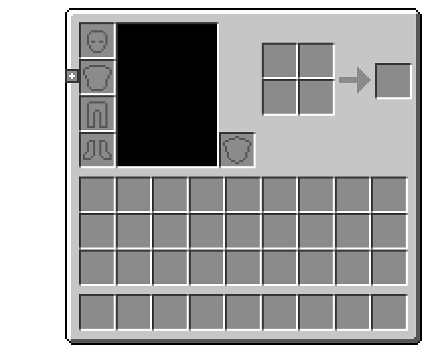
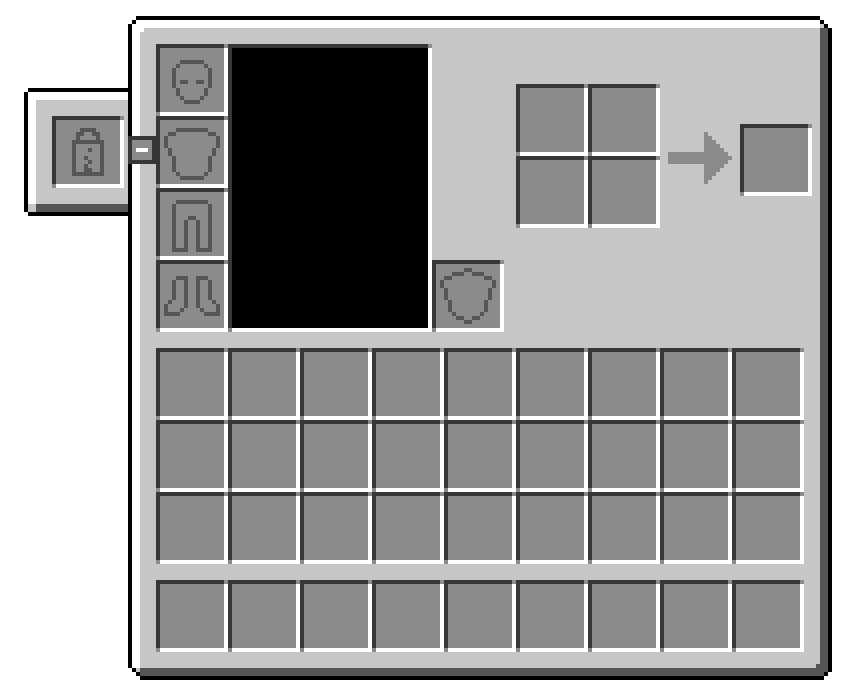
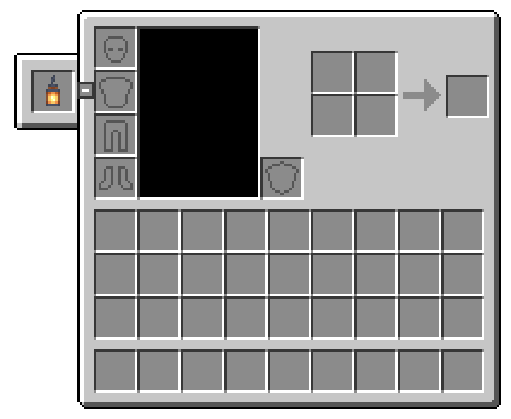

# Torch Slot — Handoff

Everything someone needs to pick up Torch Slot: what it does, what it looks like, how it is built,
where the risky parts are, and how to test and release it. For copy-paste store/social text, see
[Torch Slot — Listings.md](Torch%20Slot%20—%20Listings.md).

| | |
|---|---|
| **Mod** | Torch Slot (`torch_slot`, package `com.torchslot`) |
| **Version** | 1.0.1 |
| **Minecraft** | Java Edition 26.3 |
| **Loader** | NeoForge 26.3.0.6-beta (ModDevGradle 2.0.147) |
| **Side** | Required on **both** client and server |
| **License** | Apache-2.0 |
| **Repo** | https://github.com/Ty10y/Torch-Slot |
| **Author** | ty10young |

## Status

- Source is on `main` at https://github.com/Ty10y/Torch-Slot.
- Every mixin was checked in a dev client by force-loading all mixin targets, with no errors.
- **Play-tested** (v1.0.1) in the dev world and in a 30-mod CurseForge modpack on NeoForge 26.3.0.57, working alongside Sodium, Iris, LambDynamicLights, ImmediatelyFast, JourneyMap, Jade, Sophisticated Backpacks and Mouse Tweaks. Use the [test checklist](#test-checklist) again after bigger changes.
- v1.0.0 is released. v1.0.1 (the "+" and recipe book now take turns) is ready to release; the jar builds to `build/libs/torch_slot-1.0.1.jar`.
- Version history is in [CHANGELOG.md](CHANGELOG.md).

## What it does

Torch Slot adds one extra equipment slot, the **light slot**, to the player inventory. Whatever
light source you put there, you carry its light with you. Walk into a cave with a lantern in the
slot and the walls around you light up and move with you, so you don't have to place torches or
hold one in your offhand.

- **Accepts:** any block item that gives off light by default, plus the lava bucket. That covers
  torches, lanterns, soul variants, glowstone, sea lanterns, jack o'lanterns, froglights,
  shroomlights, end rods, and modded light blocks.
- **Brightness:** you give off the item's own light level:

  | Item | Light |
  |---|---|
  | Lantern, glowstone, sea lantern, jack o'lantern, lava bucket | 15 |
  | Torch, end rod | 14 |
  | Soul torch, soul lantern | 10 |
  | Redstone torch | 7 |
  | Magma block | 3 |

  Blocks that only glow when switched on (candles, furnaces, redstone lamps, copper bulbs) don't
  count, because their default state is unlit.
- **Holds one item.** Dropping a stack of 64 torches in places one.
- **Multiplayer:** everyone sees everyone else's light.
- **Death:** the item drops with your inventory unless `keepInventory` is on.
- **Saving:** the item is saved with the player and survives logouts, dimension changes and returning from the End.

## What it looks like

These mockups are drawn from the vanilla inventory texture at the exact pixel positions the code
uses (4× scale). Replace them with real screenshots for the store pages.

| Collapsed (default) | Popped out (empty) | Popped out (lantern) |
|---|---|---|
|  |  |  |

- **The "+" button:** a small 7×7 grey square on the inventory's left edge, level with the
  chestplate slot. Hovering lightens it and shows a "Show light slot" tooltip. Once open, it turns
  into a "−".
- **The pop-out tab:** a small panel in vanilla style (black outline, white bevel, grey shadow)
  tucked behind the left edge of the inventory, holding one slot.
- **The ghost icon:** an empty light slot shows a lantern outline, drawn in the same 1px grey
  (`#555555`) style as the vanilla armor and shield placeholders. Hovering the empty slot shows
  "Light Slot — Holds a torch, lantern or other light block".

  

- **Recipe book:** the book and the tab share the same spot, so they take turns. The "+" is always
  shown. Clicking it while the book is open closes the book and pops out the tab. Opening the book
  while the tab is out tucks the tab away.
- **Creative inventory tab:** the slot is always visible to the right of the armor, mirroring the
  offhand slot on the left. There's no "+" there.
- **Open/closed memory:** the tab remembers whether it's open until you quit the game. It starts closed.

### In the world

- The world around you brightens in a smooth sphere that fades with distance. There's no
  block-by-block stepping, because light is computed from true straight-line distance in fractional
  light levels.
- The light follows you as you walk. Nearby terrain re-lights every time you move about 0.1 blocks
  (roughly every tick at walking speed).
- Mobs, dropped items, other players and your own first-person hand are re-lit **every frame**,
  so they never lag behind.
- Putting a light in or taking it out fades it in or out over about half a second.

## How it works

```
 SERVER (authoritative)                         CLIENTS (every player in range)
 ┌──────────────────────────────┐   attachment  ┌───────────────────────────────────────────┐
 │ Player                       │     sync      │ DynamicLights.tick() — every client tick  │
 │  └ LIGHT_ITEM attachment ────┼──────────────▶│  for each player: light level from item   │
 │     (ItemStack, saved)       │               │  fade level, track position               │
 │                              │               │  moved ≥0.1 / level changed → mark chunk  │
 │ InventoryMenu                │               │  sections around old+new spot for rebuild │
 │  └ slot 46: LightSlot ───────┤               │  publish immutable Source[] snapshot      │
 │     └ LightSlotContainer     │               └──────────────┬────────────────────────────┘
 │        (reads/writes attach.,│                              │ read by
 │         syncs on change)     │        ┌─────────────────────┴───────────────────────┐
 └──────────────────────────────┘        │ LightCoordsUtil.getLightCoords  (mixin)      │
                                         │   blocks, fluids, block entities, particles  │
                                         │   — runs on chunk-mesh worker threads too    │
                                         │ EntityRenderer.getPackedLightCoords (mixin)  │
                                         │   entities + first-person hand, per frame,   │
                                         │   source positions interpolated by partialTick│
                                         └──────────────────────────────────────────────┘
```

### 1. Storage and sync (common code)

- **`ModAttachments.LIGHT_ITEM`** is a NeoForge data attachment holding one `ItemStack` per player.
  - It's saved with the player only when not empty, and has `copyOnDeath`.
  - It's synced with `ItemStack.OPTIONAL_STREAM_CODEC` to the owner and to every client tracking
    them. NeoForge also sends it on login, when another player comes into view, and on respawn.
- **`LightSlotContainer`** is a one-slot `Container` view over that attachment.
  - Every write goes through `setData`.
  - `setChanged()` calls `syncData` on the server, so any change, however it happens (click,
    shift-click, number-key swap, creative edit), reaches all clients.
- **`LightSlot`** is the `Slot` itself.
  - It accepts only light sources, has a max stack of 1, and uses the ghost lantern sprite.
  - `isActive()` is always true on the server. On the client it asks `LightSlotUi` (through a
    `BooleanSupplier` hook, so common code never touches client classes). That's how the "+"
    hides and shows the slot.
- **`LightSources.lightLevel(stack)`** returns 15 for a lava bucket. For a `BlockItem` it returns
  the block's default-state light emission, using NeoForge's context-aware overload so modded
  blocks report correctly.
- **`ServerEvents`** handles `LivingDropsEvent`. Unless `keepInventory` is on, it empties the slot
  and adds the item to the death drops (pickup delay 40).

### 2. The slot in the menu (mixins)

| Mixin | Target | Why |
|---|---|---|
| `InventoryMenuMixin` | `InventoryMenu.<init>` TAIL | Appends `LightSlot` as **slot index 46**, after the offhand (45). Vanilla's `quickMoveStack` already sends shift-clicks from unknown slots back into the main inventory. |
| `ServerGamePacketListenerImplMixin` | `handleSetCreativeModeSlot`, constant `45` | The server only accepts creative-mode slot edits for slots 1–45. This raises the limit to 46. |
| `SlotAccessor` | `Slot.x` / `Slot.y` (`@Mutable`) | Lets the creative screen move the slot (these fields are `final`). |

**Shift-clicking into the slot is deliberately off.** The server doesn't know whether the tab is
open, so shift-clicking torches around your inventory would quietly put one away. Shift-clicking
*out* of the slot works.

### 3. The inventory UI (client)

| Piece | What it does |
|---|---|
| `LightSlotUi` | Stores the open/closed state. Draws the pop-out panel and the creative slot frame. Hit-tests the panel. Draws the empty-slot tooltip. Makes the tab and recipe book take turns: "+" closes the book on the next frame by toggling it and re-running the screen's `init` (`ScreenInvoker.rebuildWidgets`), and opening the book closes the tab. |
| `LightSlotToggle` | The "+"/"−" button (`AbstractButton`, 7×7). Moves itself every frame, because the GUI shifts when the recipe book opens. |
| `InventoryScreenMixin` | Draws the panel right after the screen background but **before** the inventory texture, so the panel looks like it slides out from behind the GUI. |
| `AbstractRecipeBookScreenMixin` | `hasClickedOutside` returns false over the panel, so clicking the tab's border with an item on the cursor doesn't throw the item. |
| `CreativeModeInventoryScreenMixin` | After `selectTab`, moves the light slot to (127, 20). Without this, vanilla's layout math would put it on top of a hotbar slot. Also draws its slot frame. |
| `ClientSetup` | Wires up events: screen init (adds the button), render pre (keeps the button positioned), foreground (tooltip), mouse release (swallows the release that follows a "+" click, so it can't act as a click on the inventory), client tick, logout. |

Layout constants (relative to the GUI's top-left):

| Thing | Position |
|---|---|
| Light slot (survival) | x −18, y 26 (same row as the chestplate) |
| Pop-out panel | x −26 → 4, y 18 → 50 (the right part sits under the GUI) |
| "+" button | x 0, y 30, 7×7 |
| Light slot (creative) | x 127, y 20 |

### 4. Dynamic lighting (client)

This is the core of the "smooth" requirement. It all lives in **`DynamicLights`**.

1. **Every client tick:**
   - It scans `level.players()` and reads each player's `LIGHT_ITEM` (spectators are skipped).
   - Each lit player is tracked by entity ID. The light sits at hip height:
     `y + 0.55 × bounding-box height`.
   - The level eases toward its target by 1.5 levels per tick, which is the fade.
   - Players who leave view fade out where they were last seen.
2. **Re-meshing:**
   - Terrain lighting is baked into chunk meshes. When a light has moved at least 0.1 blocks, or its
     level changed, it marks dirty every chunk section within `level + 1.5` blocks of the old spot
     **and** the new spot, using a sphere-vs-box test.
   - That's `Minecraft.levelExtractor.setSectionDirty`. The rebuilds run asynchronously on the
     vanilla worker threads.
3. **Light formula:** `light = level − distance`, clamped to 0 or more, using the true 3D distance
   in blocks.
   - Packed light coordinates store block light in the low byte as `level × 16` (0–240). Writing a
     **fractional** value there (for example 13.4 → 214) makes the falloff continuous, because the
     lightmap is sampled between its texels.
   - The result is the max of vanilla's block light and the dynamic light. Sky light is untouched.
4. **Thread safety:** chunk meshing runs on worker threads. The tick publishes an immutable
   `Source[]` through a `volatile` field, and readers only ever see a complete snapshot.
5. **Two hooks:**
   - `LightCoordsUtilMixin`: the RETURN of
     `LightCoordsUtil.getLightCoords(BrightnessGetter, BlockAndLightGetter, BlockState, BlockPos)`.
     Block models (smooth and flat lighting), fluids, block entities, particles and paintings all
     funnel through it.
   - `EntityRendererMixin`: the RETURN of `EntityRenderer.getPackedLightCoords`. It uses the
     entity's per-frame light-probe position and source positions interpolated by `partialTick`, so
     the wearer, nearby mobs and the first-person hand change smoothly between ticks.

Tuning knobs (constants in `DynamicLights`):

| Constant | Value | Effect |
|---|---|---|
| `REBUILD_DISTANCE_SQR` | 0.1² | Lower is smoother terrain but more rebuilds. |
| `FADE_PER_TICK` | 1.5 | Equip/unequip fade speed (15 levels ≈ 0.5 s). |
| `SECTION_MARGIN` | 1.5 | Extra reach when picking sections to rebuild, because smooth lighting samples neighbouring blocks. |
| hip height | 0.55 × height | Where the light sits on the body. |

## File map

```
src/main/java/com/torchslot/
  TorchSlot.java                 @Mod entrypoint; registers attachments
  ModAttachments.java            LIGHT_ITEM attachment (save, copy-on-death, sync)
  LightSources.java              which items glow and how brightly
  LightSlot.java                 the Slot (index 46, layout constants, ghost icon, client visibility hook)
  LightSlotContainer.java        1-slot Container over the attachment; syncs on change
  ServerEvents.java              drops the item on death unless keepInventory
  client/
    ClientSetup.java             client event wiring
    DynamicLights.java           moving-light engine (tracking, fade, re-meshing, light math)
    LightSlotUi.java             panel drawing, open state, hit-testing, tooltip
    LightSlotToggle.java         the + / − button
  mixin/
    InventoryMenuMixin.java                  add the slot
    ServerGamePacketListenerImplMixin.java   accept creative edits to slot 46
    SlotAccessor.java                        move slots (creative)
    client/
      AbstractContainerScreenAccessor.java   leftPos / topPos / hoveredSlot
      AbstractRecipeBookScreenAccessor.java  recipe book visibility
      AbstractRecipeBookScreenMixin.java     panel clicks aren't "outside"
      CreativeModeInventoryScreenMixin.java  creative slot position + frame
      EntityRendererMixin.java               per-frame entity light
      InventoryScreenMixin.java              draw the panel behind the GUI
      LightCoordsUtilMixin.java              block/terrain light
      ScreenInvoker.java                     rebuildWidgets (re-layout after closing the book)
src/main/resources/
  torch_slot.mixins.json
  assets/torch_slot/lang/en_us.json
  assets/torch_slot/textures/gui/sprites/container/slot/lantern.png   (16×16 ghost icon)
src/main/templates/META-INF/neoforge.mods.toml
docs/images/                                   UI mockups used in this doc
```

## Known limitations and risks

| Item | Notes |
|---|---|
| **Light passes through walls** | The light uses straight-line distance and doesn't flood-fill, so it can light the far side of a thin wall within range. Other dynamic-light mods (LambDynamicLights and similar) behave the same way. Fixing it would need a per-tick flood fill around each light. |
| **Re-meshing cost** | A lit player moving re-meshes up to about 27 chunk sections per tick (async). Fine on modern PCs. Several lit players bunched together, or flying fast, will cost more. If it becomes a problem: raise `REBUILD_DISTANCE_SQR`, add a client config, or rebuild only sections that actually changed. |
| **Mod compatibility** | Play-tested working alongside Sodium, Iris, LambDynamicLights, ImmediatelyFast, JourneyMap, Jade, Sophisticated Backpacks and Mouse Tweaks. Sodium replaces chunk meshing, so if a future Sodium version stops calling `LightCoordsUtil`, terrain lighting is the first thing to check. Other mods that also add slots to `InventoryMenu` could clash over index 46. |
| **Not visible on the body** | Nothing is drawn on the player model yet. |
| **Creative edits** | A creative player can put *any* item in the slot through the creative packet path. Harmless, because non-lights give 0 light. |
| **Window edge** | On very small windows or high GUI scale, the pop-out tab can run off the left edge of the screen. |
| **Recipe book** | Shares the tab's spot. Opening one closes the other. In a very narrow window the book covers the whole inventory, "+" included, as vanilla's book does. |

## Test checklist

Run `./gradlew runClient`, make a survival world, and check:

- [ ] "+" sits on the left edge beside the chestplate. Its tooltip reads "Show light slot".
- [ ] Clicking "+" pops out the tab with the ghost lantern, and the button becomes "−".
- [ ] Hovering the empty slot shows the "Light Slot" tooltip.
- [ ] Non-light items are refused. Torch, lantern and glowstone are accepted, one at a time.
- [ ] Clicking the tab's border with an item on the cursor does **not** throw the item.
- [ ] Clicking "+" while holding an item on the cursor doesn't drop or place it.
- [ ] With the tab out, opening the recipe book tucks the tab away. The "+" stays visible.
- [ ] With the book open, clicking "+" closes the book and pops out the tab, and the recipe button moves back.
- [ ] At night or in a cave, the light fades in. Walking moves it smoothly, with no visible steps.
- [ ] Your hand and nearby mobs brighten and dim smoothly as you move.
- [ ] Removing the item fades the light out.
- [ ] Soul torch is clearly dimmer than a lantern.
- [ ] Creative inventory tab shows the slot right of the armor, and items placed there stick after reopening.
- [ ] Logging out and back in keeps the item.
- [ ] Death without `keepInventory` drops the item. With `keepInventory`, you keep it.
- [ ] Nether round trip keeps the item.
- [ ] LAN or dedicated server with a second player: each sees the other's light.
- [ ] `./gradlew runServer` starts cleanly. This confirms no client classes leak into server code.

## Build and release

```
./gradlew build                       # -> build/libs/torch_slot-<mod_version>.jar
```

- Gradle runs on JDK 21 (see `org.gradle.java.home` in `gradle.properties`), and the mod compiles
  with the Java 25 toolchain. This matches the sibling PlayerMaps and ArrowFletching projects.
- **Release steps:**
  1. Bump `mod_version`.
  2. Build.
  3. Tag `vX.Y.Z` on GitHub and create a release with the jar attached. Release text is in the
     listings doc.
  4. Upload the same jar to CurseForge.
- Jars are **not** committed; `build/` is git-ignored.

## Ideas for later

- Draw the item on the player: a lantern hanging at the hip, or a torch on the back.
- Client config: on/off, update rate, falloff, max light.
- Server config: an allow/deny list, or an item tag such as `torch_slot:light_sources`, so packs can add items.
- Light that flows around walls, using a per-tick flood fill.
- Optional fuel: torches burn out after a while.
- A keybind to toggle the light without opening the inventory.

## Notes on 26.3 APIs (for future porting)

- GUI drawing is `GuiGraphicsExtractor`, and render methods are named `extract*`
  (`extractBackground`, `extractContents`, `extractWidgetRenderState`).
- `ResourceLocation` is now `Identifier`.
- The current screen is `Minecraft.getInstance().gui.screen()`.
- Light lookups live in `net.minecraft.util.LightCoordsUtil`. Chunk dirty-marking is on `Minecraft.levelExtractor`.
- Prefer NeoForge's `BlockState#getLightEmission(BlockGetter, BlockPos)`. The no-arg version is deprecated.
- Decompiled sources: `../ArrowFletching/build/moddev/artifacts/minecraft-patched-26.3.0.6-beta-sources.jar`.
